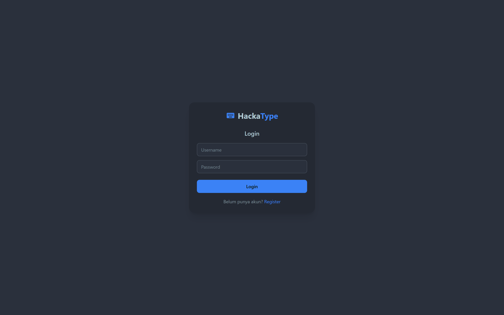
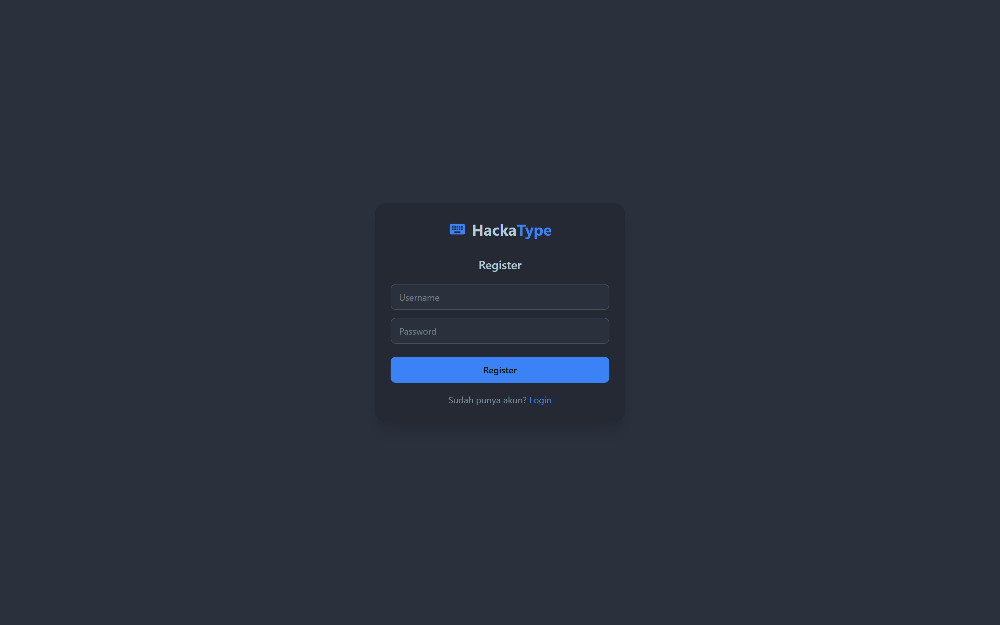
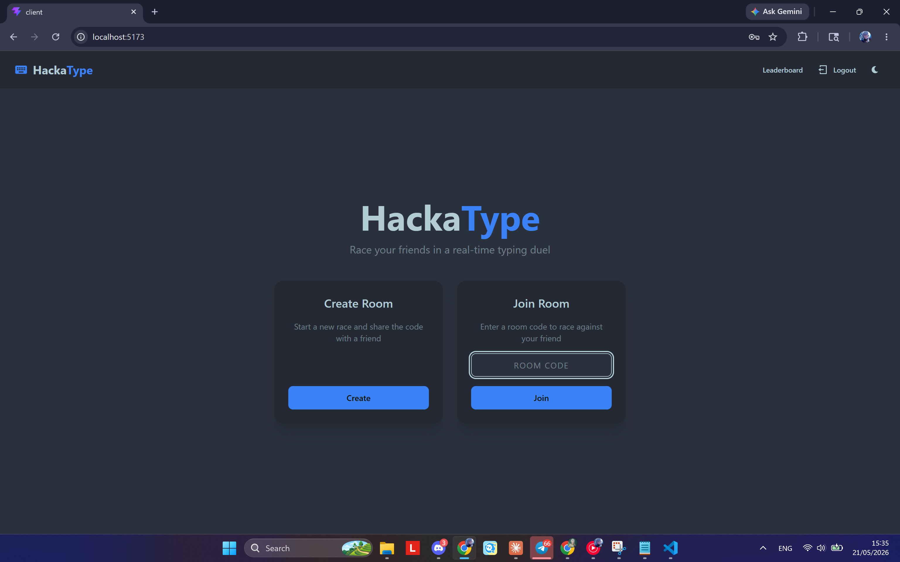
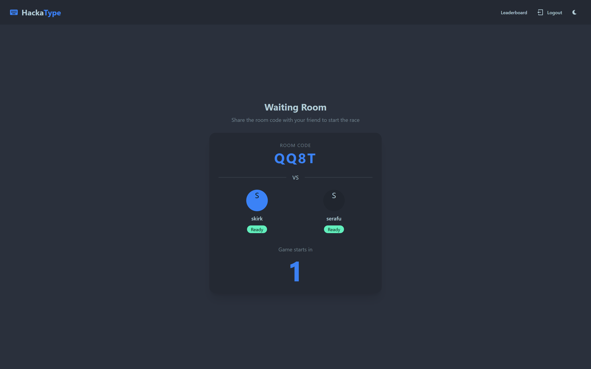
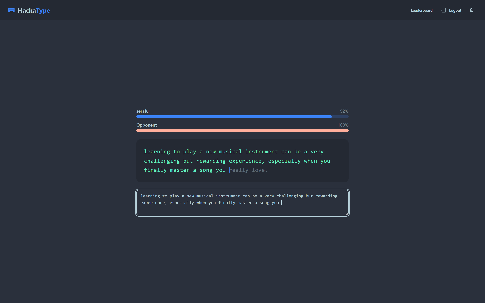
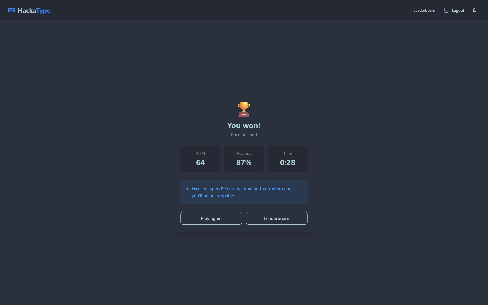
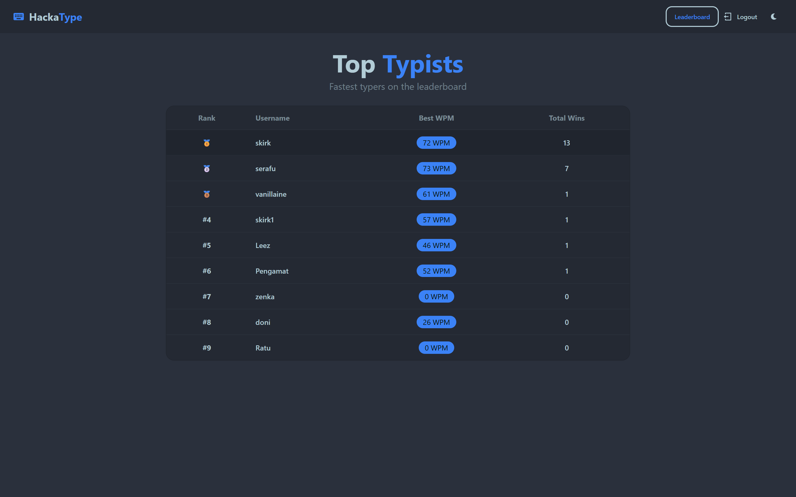

# HackaType ⌨️

> Race your friends in a real-time typing duel — powered by Socket.io and Gemini AI.

## 🔗 Links

- **Client:** [github.com/HCK-94-GP-G1/hackatype-client](https://github.com/HCK-94-GP-G1/hackatype-client)
- **Server:** [github.com/HCK-94-GP-G1/hackatype-server](https://github.com/HCK-94-GP-G1/hackatype-server)

---

## 📖 About

HackaType is a real-time multiplayer typing race app where two players compete head-to-head. Create a room, share the code with a friend, and race to finish the AI-generated typing prompt first. Track your WPM, accuracy, and climb the leaderboard.

---

## ✨ Features

- **Authentication** — Register and login with JWT
- **Create & Join Room** — Generate a room code and invite a friend to race
- **Real-time Race** — Live progress tracking for both players via Socket.io
- **AI-Generated Prompts** — Typing prompts generated by Gemini AI
- **Result Page** — See your WPM, accuracy, time, and win/loss result with AI feedback
- **Leaderboard** — Top Typists ranked by best WPM and total wins
- **Dark / Light Mode** — Toggle theme preference

---

## 📸 Screenshots

<table>
  <tr>
    <td align="center"><br/><sub>Login</sub></td>
    <td align="center"><br/><sub>Register</sub></td>
  </tr>
  <tr>
    <td align="center"><br/><sub>Home</sub></td>
    <td align="center"><br/><sub>Waiting Room</sub></td>
  </tr>
  <tr>
    <td align="center"><br/><sub>Game</sub></td>
    <td align="center"><br/><sub>Result</sub></td>
  </tr>
  <tr>
    <td align="center" colspan="2"><br/><sub>Leaderboard</sub></td>
  </tr>
</table>

---

## 🛠️ Tech Stack

**Server**

- Node.js + Express.js
- PostgreSQL + Sequelize ORM
- Socket.io
- JWT + bcryptjs
- Gemini AI (`@google/genai`)

**Client**

- React + Vite
- Socket.io-client
- Tailwind CSS + DaisyUI
- React Router

---

## 📁 Project Structure

```
hackatype/
├── client/
│   ├── src/
│   │   ├── components/
│   │   │   └── Navbar.jsx
│   │   ├── context/
│   │   │   └── ThemeContext.jsx
│   │   ├── layouts/
│   │   │   ├── AuthLayout.jsx
│   │   │   └── MainLayout.jsx
│   │   ├── lib/
│   │   │   └── socket.js
│   │   ├── views/
│   │   │   ├── LoginPage.jsx
│   │   │   ├── RegisterPage.jsx
│   │   │   ├── HomePage.jsx
│   │   │   ├── WaitingRoom.jsx
│   │   │   ├── GamePage.jsx
│   │   │   ├── ResultPage.jsx
│   │   │   └── LeaderboardPage.jsx
│   │   └── App.jsx
│   └── package.json
└── server/
    ├── controllers/
    │   ├── authController.js
    │   └── leaderboardController.js
    ├── helpers/
    │   ├── bcrypt.js
    │   ├── jwt.js
    │   └── gemini.js
    ├── middlewares/
    │   ├── authentication.js
    │   └── errorHandler.js
    ├── migrations/
    ├── models/
    │   ├── user.js
    │   └── gameresult.js
    ├── routers/
    ├── socket/
    │   └── gameHandler.js
    ├── app.js
    └── bin/www
```

---

## 🚀 Getting Started

### Prerequisites

- Node.js
- PostgreSQL

### Server Setup

```bash
cd server
npm install
cp .env-example .env
```

Fill in `.env`:

```env
JWT_SECRET=your_jwt_secret
GEMINI_API_KEY=your_gemini_api_key
```

Run migration and start:

```bash
npx sequelize-cli db:create
npx sequelize-cli db:migrate
npm run dev
```

### Client Setup

```bash
cd client
npm install
npm run dev
```

---

## 👥 Contributors

Built as a group project at Hacktiv8 Fullstack JavaScript Bootcamp, Phase 2.
